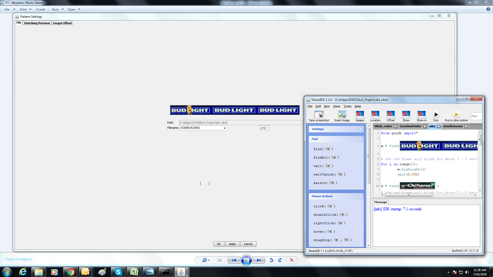
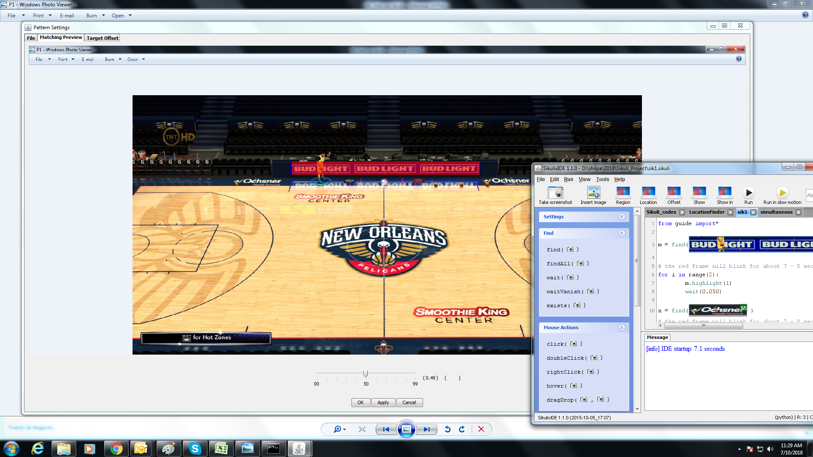
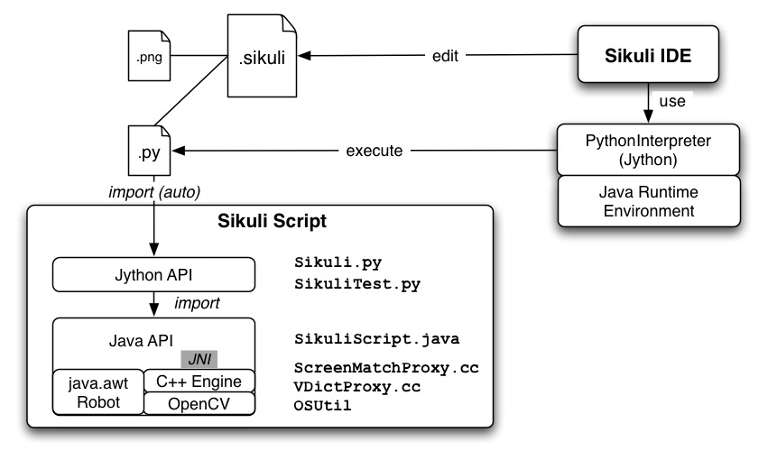
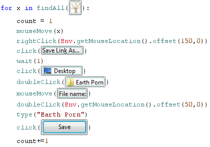
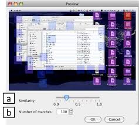

# Sikulix

Sikulix for our requirements is used in detecting logos/objects in arenas/stadiums in images/videos.This application can be extended to any sort of requirements depending on the suitability
Sikuli is known as God's Eye which is used to automate the desktop as well as web applications with/without API's.SikuliX automates anything you see on the screen of your desktop computer running Windows, Mac or some Linux/Unix. It uses image recognition powered by OpenCV to identify and control GUI components. This is handy in cases when there is no easy access to a GUI's internals or the source code of the application or web page you want to act on.

SikuliX supports as scripting languages

1. Python language level 2.7 (supported by Jython)
2. running RobotFramework text-scripts is supported (see docs)
3. Ruby language level 1.9 and 2.0 (supported by JRuby)
4. JavaScript (supported by the Java Scripting Engine)

Though SikuliX is currently not available on any mobile device, it can be used with the respective emulators on a desktop computer or based on VNC solutions. A solution for Android devices based on ADB (Android Debugging Bridge) is in an early experimental stage,
Besides locating images on a screen SikuliX can run the mouse and the keyboard to interact with the identified GUI elements. This is available for multi monitor environments and even for remote systems with some restrictions.
SikuliX comes with text recognition (OCR) and can be used to search for text. This feature is powered by Tess4J / Tesseract.

# When is SikuliX useful? 

We want to automate some repetitive tasks in
- daily usage of applications or web pages
- playing games
- administration of IT systems and networks

# How can I get SikuliX? 

SikuliX can be downloaded from SikuliX's Launchpad page. What you download from there is sikulisetup-X.Y.Z.jar (where X.Y.Z is the version number).
Qickstart - http://sikulix.com/quickstart/
You should put it in a separate folder in a prominent place, since it is intended to stay there for ever ;-) together with other SikuliX artefacts you will get later on, either by will or because SikuliX creates them on the fly. It is not recommended to put any scripts, images or other user stuff into that folder.

# How do I use SikuliX? 

One sets up and runs more or less complex SikuliX workflows based on searching images and acting on GUI elements with mouse and keyboard. For this one uses the so called SikuliX IDE, that brings some basic support for editing and running scripts.
In the Scripting usage scenario, you handle SikuliX scripts named you-name-it.sikuli, which are folders containing the script file and the images you need for the workflow. You either run the scripts from within the SikuliX IDE or from the command line.

###Programming

In a mature IDE (IntelliJ IDEA, Eclipse, NetBeans, ...) and/or some testing environment one integrates SikuliX as a feature library using the available API's while programming in Java or Java aware/based languages (Jython, JRuby, Scala, Clojure, ...).

Where can I get help? 

Link- https://launchpad.net/sikuli

Link - https://github.com/RaiMan/SikuliX1

In our application ,we have used sikulix GUI automation tool to highlight some of the interested objects in an image and find the number of objects present in an image by pixel matching criteria.

***Screen class in Sikuli***

Screen class is the base classes for all the methods provided by Sikuli. Screen class contains predefined methods for all the commonly performed operations on screen elements such as click, double-click, providing input to a text box, hover, etc. The below is the list of commonly used methods provided by Screen class.

1. Method
getFileName
Description: Returns the file name contained in the Pattern object.
Syntax: Pattern p = new Pattern("D:\Demo\QA.png");

String filename = p.getFileName();

2. Similar
Description: This method returns a new Pattern object with similarity set to a specified value. It accepts the similarity value between 0 to 1 as a parameter. Sikuli looks for all elements that fall within the specified similarity range and returns a new pattern object.
Syntax: Pattern p1 = p.similar(0.7f);

3. Exact
Description: This method returns a new pattern object with similarity set to 1. It looks only for an exact match of the specified element.
Syntax: Pattern p1 = p.exact();

There are basically 3 categories of tools:

- Recorder while you manually work along your workflow, a recorder tracks your mouse and keyboard actions. After stopping the recording, you might playback (autorun your worflow). The recordings can usually be edited and augmented with additional features.
- GUI aware the tool allows to programmatically operate on GUI elements like buttons. This is based on the knowledge of internal structures and names of the GUI elements and their features. Some of these tools also have a recording feature.
- Visually the tool “sees” images (usually retangular pixel areas) on the screen and allows one to act on these images using mouse and keyboard simulation. There might be some recorder feature as well with such a tool.

SikuliX belongs to the 3rd category and currently does not have a recorder feature. While you work through your workflow you capture some images, that you want to act on or that you expect to appear after an action. These images are used by click and type actions or are used to wait for the screen to be ready for the next action.

# SikuliX - how does it find images on the screen?

SikuliX uses the OpenCV package for finding an image on the screen.
A basic feature in Sikulix is to wait for an image to appear in a given region:

### some top left part of the screen
aRegion = Region(0, 0, 500, 500)
### A png image file on the file system
### this is the image we want to look for in the given Region
aImage = “someImage.png”
### search and get the result
aMatch = aRegion.find(aImage)

To not make it too complicated here, I do not talk about how you create the aImage - we just assume it is there and accessible.
The matchTemplate() expects an even sized or larger image (base), where the given image (target) should be searched. To prepare that, we internally make a screenshot (using Java Robot class) of the screen area defined by the given aRegion. This now is the base image and held in memory. The target image is also created as in memory image read form the image file. Both images then are converted to the needed OpenCV objects (CVMat).

Now we run the matchTemplate() function and get a matrix in the size of the base image, that contains for each pixel a similarity score for the target image compared pixel by pixel with it’s top left corner at this pixel location. If this is not clear here now, go back to the above example and try to understand. The score values at each pixel location vary between 0.0 and 1.0: the lower the value, the lower the probability, that the area with it’s top left corner at this pixel location contains the target image. Score values above 0.7 - 0.8 signal a high probability, that the image is here.

In the next step, we use another OpenCV method, to get the relevant max value (result score) from the mentioned result matrix, meaning that we are looking for a pixel, that most probable is the top left corner of the target image in the base image.

If nothing else is said, only a result score > 0.7 is taken as found. The other values will signal a FindFailed exception. Depending on various aspects of the target image (mainly how much even background towards the edges in contained in the target image), one usually get result scores > 0.8 or even 0.9. If one follows SikuliX’s recommendation how to create target images, one should in most cases get result scores >0.95 or even >0.99 (internally taken as exact match with 1.0).

If the result score is accepted as found, in the next step we create a match object, that denotes the region on the screen, that most probably contains the image (aMatch in the above snippet).

If the image is not found (result score not acceptable), we either terminate the search operation signalling failed or start a new search with a new screenshot of the given region. This is repeated until the image is either found or the given or implicit waiting time (3 seconds in the standard) has elapsed, which also results in a FindFailed signal. The rate of this repetition can be specified, to reduce the cpu usage by SikuliX, since the search process is pure number crunching.

A word on elapsed time for search operations: The larger the base image the longer the search. The smaller the size difference of the 2 images, the faster. On modern systems with large monitors searching a small to medium sized image (up to 10.000 pixels), the elapsed time might be between 0.5 and 1 second or even more. The usual approach, to reduce search time is to reduce the search region as much as possible to the area, one expects the target image to appear. Small images of some 10 pixels in search regions of some 1000 pixels are found within some 10 milliseconds or even faster.

Sikulix implements a still-there-feature: before searching in the search region, it is first checked, whether the image is still in the same place as at the time of the last search (if the search region contains this last match). On success, this preflight operation usually takes some milliseconds, which speeds up workflows if they contain repetitive tasks with the same images.

Not knowing the magic behind SikuliX’s search feature and the matchTemplate() function, people always wonder, why images showing up multiple times on the screen, are not found in some regular order (e.g. top left to bottom right). That this is not the case is caused by the implementation of the matchTemplate() function as some statistical numeric matrix calculations. So never expect SikuliX to return the top left appearance of a visual being more than once on the screen at time of search. The result is not predictable in this sense.

If you want to find a specific item of these multiple occurrences, you have to restrict the search region, so that only the one you are looking for is found.

For cases where this is not suitable or if you want to cycle through all appearances, we have the findAll() method, that returns a list of matches in decreasing result score order. You might work through this list according to their position on the screen by using their (x,y) top left corner coordinates. findAll internally evaluates the search result matrix, by repetitively looking for the next max value after having “switched off” some area around the last max.

# SikuliX - handling of images

To use images with the features of SikuliX like click(someImage), you need to store these images as image files preferably in the PNG format (someImage.png) somewhere on the file system or somewhere in the internet.

An image in this sense is some rectengular pixel area taken from the screen (captured or made a screenshot - with Sikuli we use the verb capture as the process of taking the image and save it in an image file and the name screenshot for the artifact “visual object = image”).

Capturing is supported by the IDE or programmatically via the respective SikuliX features. You might use any capture tool instead to get your images (preferably in PNG format).

To load the images SikuliX has 2 principles:
- bundle path: the images are stored together with the script file (.py for Python, .rb for Ruby, .js for JavaScript) in a folder named someScript.sikuli, where the scriptfile must be named the same as the folder (e.g. someScript.py). This all is automatically assured, when working with the SikuliX IDE.
- image path: additionally SikuliX supports a list of places as an image path. Possible places are folders in the file system, folders in a jar-file and folders somewhere in the internet. There are functions available to manage your own image path. When an image has to be loaded (exception: the absolute path is given), the places are sequentially checked for the existence of the image. The first matching place wins.

It is planned to have a capturing tool as a standalone app, that supports the basic aspects of image handling:
- capture and recapture screeshots along a workflow (some kind of recorder)
- organize your image path
- organize groups of “same” images, that can be switched depending on environment aspects
- organize a group of images, that somehow relate to each other and should be found together
- organize different states of an image (e.g. selected/not selected)
- optimize screenshots to get the highest possible scores at find

# SikuliX - system specifics

Some general aspects
his is valid for version 1.1.4+ (prior versions are no longer supprted)

Might be a good idea to first read this SikuliX 1.1.x Quickstart.

SikuliX does only support 64-Bit Systems.

A major aspect of SikuliX is to be available on Windows, Mac and Linux with as little differences as possible. This means, that features will only be added to SikuliX as standard, if they can be made available on all these systems. Nevertheless it is possible to add extensions or plugins, that might not be available for all systems.

SikuliX is a Java based application or library. Hence the usable artifacts are delivered as jar-files.

To use the SikuliX features you need a valid Java runtime installation of at least version 8 (Oracle JRE or JDK). Java 9+ is supported with version 1.1.4+ (preferably OpenJDK latest, version 12 as of March 2019).

The Sikulix artefacts sikulix.jar and/or sikulixapi.jar can be moved around as needed (though it is still recommended to have the SikuliX stuff in one well defined place, to avoid update/upgrade problems). Everything else SikuliX needs during runtime is stored either in the system’s temp space or in a special system specific area in the user’s home space (see the system specific topics below). Missing or outdated things in these areas are created/recreated at runtime by SikuliX automatically (means: you can delete everything at any time, as long as you keep the jars).

For the same reason when working with other IDE’s, it is strongly recommended to work with links/pointers to sikulixapi.jar and in case the Lib folder (Python stuff) and not having copies in different places.

The current layout of this space is as follows (we call it SikulixAppData):

- Extensions (place for extensions/Plugins)
- Lib (the stuff to support Jython/JRuby usage)
- SikulixDownloads (non SikuliX artefacts like Jython, JRuby, Tesseract support, …)
- SikulixLibs (folder containing system specific native libraries)
- SikulixStore (place for persistent or optional information)
- SikulixTesseract (place for language specific tessdata files)
- Currently there is no need to step into these folders except for debugging purposes. In case of startup problems, it might help to delete SikulixAppData and restart.

SikuliX in the standard does not need any environment settings anymore. It is a good idea, to remove anything from your environment, that points to stuff from prior versions.

# SikuliX on Windows

The IDE is only available as jar-file, that can be double-clicked to start it.

Usage in a command window: java -jar <path-to>/sikulix.jar (for options see)

The SikulixAppData is stored in the folder Sikulix inside the folder the environment variable %APPDATA% points to.

Besides Java there are no prerequisites. All native libraries are bundled in the jar-files and exported at runtime as needed.

# SikuliX on Mac

The IDE is only available as jar-file, that can be double-clicked to start it.

Usage in a Terminal window: java -jar <path-to>/sikulix.jar (for options see)

The SikulixAppData folder is here ~/Library/Application Support/Sikulix

Besides Java there are no prerequisites. All native libraries are bundled in the jar-files and exported at runtime as needed.

# SikuliX on Linux

As Java you should use the OpenJDK versions (or the Oracle versions where appropriate).

The IDE is only available as jar-file, that can be double-clicked to start it (setting the executable bit of the jar-file might be necessary).

Usage in a Terminal window: java -jar <path-to>/sikulix.jar (for options see)

On Linux Systems SikuliX cannot be used out of the box. For the details see New in 1.1.4.

One has to provide the libraries OpenCV and Tesseract and additionally the packages wmctrl and xdotool, when you want to use the App class features.

Special information on the bundled libJXGrabKey.so

At least on newer Ubuntu versions ldd -r reports unresolved symbols pthread… It seems, that this can be ignored, since JXGrabKey works. If you get problems, that are related to JXGrabKey, you might have to build from the sources and provide the ready built library in the ~/.Sikulix/SikulixLibs folder.

# Tool

The below image describes the tool view-

The tool has the below functionalities-

- "Take screenshot" : Takes the screenshot of the object that we want to search/count/detect in an image/video.
we can score every object using matching preview statistics and setting the match parameter manually to search and locate the object in image/video.

- "Insert image" : Local system files to insert the screenshot onto the tool in code is provisioned.

- "Region" : We can take screenshot of a region in an image to detect it on a fresh image.

- "Location" : We can take Xmax,Ymax,Xmin,Ymin the coordinates of objects/patterns.

- "Show in" : We can zoom the input image to the tool or code.

- "Show out" : We can Zoom out of input image to tool or code.

- "Message" : Console to showcase the outputs or track the objects.

- Functions are listed on left side bar of the tool such as hover(),click(),dragDrop()...etc

### Sikulix Working

### MatchingPreview/Setting Score parameter

We can scroll the cursor over the scale to set the matching/scoring parameter and then see the background image to see the simulation of objects Bounded areas/regions.

## Documentations referred

-Follow link for Sikulix scripting: https://sikulix-2014.readthedocs.io/en/latest/
-Link to follow up :http://sikulix.com/
-Link to future of AI: https://blogs.microsoft.com/blog/2018/01/17/future-computed-artificial-intelligence-role-society/

## Projects Built on Sikulix

-As a demonstration of what you can do with Sikulix, Raiman's team have built a simple machine learning tool for Windows/Mac/Linux called sikulix , using Sikulix. Follow this Sikulix to download page of the application and its source code.
-We also welcome submissions of applications and systems built by you and powered by Sikukix for listings here. Should you want your Sikulix powered developments listed here, you can reach to us via our Contacts below.

## Contact Developer
  -Shilpa Jagadeeshappa
    - Email:shilpatc25@gmail.com
    - Github:https://github.com/ShilpaJagadeeshappa
    - Facebook: https://www.facebook.com/shilpasj.25
    - LinkedIn: https://www.linkedin.com/feed/?trk=hb_signin
## Contributors

We are inviting anyone who wishes to contribute to the Sikulix project to reach to us.We give special thanks to Raimond Hook and Wilson Mar for his incredible and excellent work in Sikulix and its documantations. Find below the contact details of those who have contributed immensely to the Sikulix project.
  - Youtube: https://www.youtube.com/user/wilsonmar
  - LinkedIn: https://www.linkedin.com/in/wilsonmar?src=aff-ref&veh=jobs_aff_ir_pid_27795_plc_Viglink%20Primary_adid_637360&trk=jobs_aff_ir_pid_27795_plc_Viglink%20Primary_adid_637360&clickid=RDOUf-0zLxyOURc0Rw0UrUzuUknwtpUXfwuMUU0&irgwc=1
  - Github: https://github.com/wilsonmar
  - Github: https://wilsonmar.github.io/opencv-sikulix-robot/
 
 ## References
 
  1. [Online] Available: scholar.google.fr/scholar?hl =
fr&q = Object + detection + using + Haar − cascade +
Classif ier&btnG = &lr =
  2.  [Online] Available: lab.cntl.kyutech.ac.jp/ ∼ kobalab/
nishida/opencv/OpenCV ObjectDetection HowT o.pdf
  3.  [Online] Available: cs.colby.edu/maxwell/courses/cs397
− vision/F07/papers/viola − F aces − cvpr01.pdf
  4.  [Online] Available: cbcl.mit.edu/publications/ps/heisele
− x3hei.lo.pdf
  5. [Online] Available: arxiv.org/pdf/1502.05461v1.pdf
  6. [Online] Available: www.svcl.ucsd.edu/projects/traff ic/
  7. S.Z. Li, L. Zhu, Z. Zhang, A. Blake, H. Zhang, H. Shum,
Statistical learning of multiview face detection, in: ECCV ’02:
Proceedings of the European Conference on Computer Vision,
Lecture Notes in Computer Sciences, vol. 2353, London, UK,
2002, pp. 67-81
  8. R. Lienhart, J. Maydt, An extended set of Haar-like features
for rapid object detection, in: ICIP ’02: Proceedings of the
International Conference on Image Processing, 2002, pp. 900-
903
  9. P. Viola, M.J. Jones, Rapid object detection using a boosted
cascade of simple features, in: CVPR ’01: Proceedings of the
Conference on Computer Vision and Pattern Recognition, Los
Alamitos, CA, USA, 2001, pp. 511-518.
  10.  M. Jones, P. Viola, Fast multi-view face detection, Technical
Report MERLTR2003-96, Mitsubishi Electric Research Laboratories, July 2003.
  11. Viola, P.; Jones, M., ”Rapid object detection using a boosted
cascade of simple features,” Computer Vision and Pattern Recognition (CVPR), 2001 IEEE Conference on, June 2001.
  12. [Online] Available: ir.library.louisville.edu/cgi/
viewcontent.cgi?article = 2731&context = etd
  13. C.P. Papageorgiou, M. Oren, T. Poggio, A general framework
for object detection, in: ICCV ’98: Proceedings of the International Conference on Computer Vision, Washington, DC, USA,
1998, pp. 555-562.
  14. [Online]Link: https://www.researchgate.net/post/Can_you_name_some_object_detection_methods
  15. [Online]Link: https://www.mathworks.com/discovery/object-detection.html
  16. [Online]Link: http://ijarcet.org/wp-content/uploads/IJARCET-VOL-2-ISSUE-4-1383-1388.pdf
  

